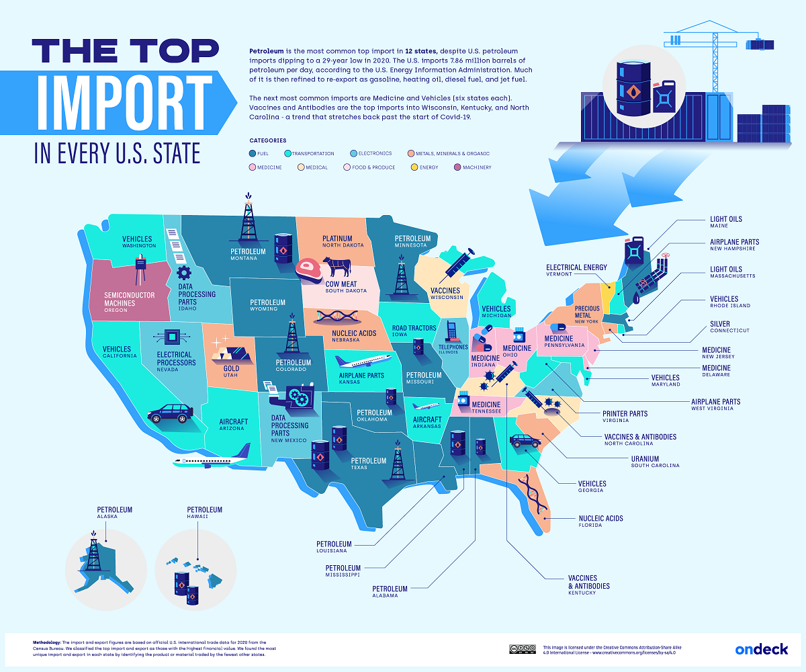
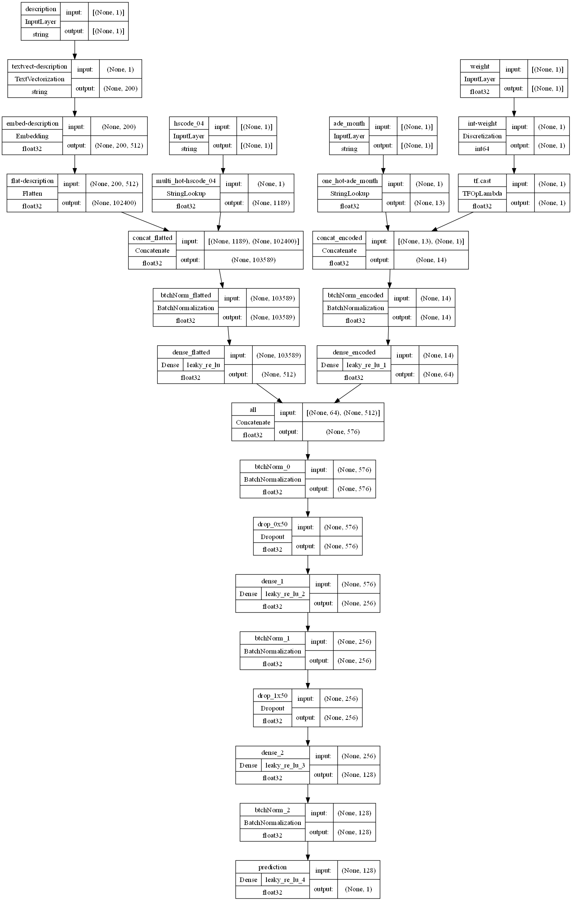
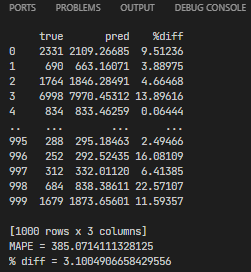

<p align="center">

</p>


# BoL USD Import Value Prediction.
ML project for prediction of exact import value in the USD for consignees.

## Objective.
In the most cases a Bill of Lading does not include an import value for its cargo.\
Or it can contain a 'faked' value for some reasons.
And we would want to be able based on minimal information in a BoL to get an estimation of cargo value.

## Data.
As a train data it have been used the preprocessed BoL US Import data from AMS provider
for 2016 - 2020 years.

The datasets' volumes:
* train dataset: 2,533,984 records
* validation dataset: 633,496 records
* test dataset: 791,871 records.

## Model.
### Target:
The model provides evaluation (prediction) for a `"value_usd"` parameter of a bill of lading.

### Input:
As an input the model eats the next:
* First 3 letters of a month of arrive date estimated,
* First 4 digits of cargo's HS Code,
* Raw human textual description of goods,
* Weight of cargo in kg.

```
Input sample:
{
    "ade_month":   [str]   # "FEB"
    "hscode_04":   [str]   # "6105"
    "description": [str]   # "MEN S RECYCLE POLYESTER KNITTED SWEATSHIRT S C NO HS CODE PO NO CUST NO QTY "
    "weight":      [int]   # 919
}
```

### Output:
The model's output is the JSONResponse like this:
```
{
    "value_usd": [
        [1184.15087890625],
        [9248.1279296875],
        [8119.25830078125]
    ]
}
```

### The Model Architecture:
Using a Transformer's architecture in this particular case does not make a sense because a words'
order in a description does not care a positional and contextual sense.\
The model exploits an embeddings for the `"description"` and encoding for `"hscode_04"` and `"ade_month"` variables.




##### Model prediction for random unseen 1000 samples:


----

#### _Project Notes_:
1. Target's log-transformation makes noticeable difference in the model's performance with origin data.
2. In the model it can be switched on an ability to use an inflation factor. But appling this (`"value_2022"`) instead of `"value"` does not influence on the performance significantly.
